# Architecture

Nagarik Signal separates private civic operations from public proof. Postgres
owns workflow state. Private object storage owns media bytes. Solana stores
versioned commitments after the database has recorded durable intent.

## Write Path

```mermaid
flowchart LR
  A["Invite capability"] --> B["Private upload"]
  B --> C["Decode, limit, sanitize, hash"]
  C --> D["Private staged object"]
  D --> E["Private submission transaction"]
  E --> F["Operator review"]
  F --> G["Approved public derivative"]
  G --> H["Immutable public version and outbox"]
  H --> I["Bounded v2 signer worker"]
  I --> J["Finalized Solana observation"]
  J --> K["Public projection"]
```



The submission transaction consumes one-time media receipts, stores the private
record, appends audit context, and schedules durable media promotion. Approval
freezes a public-safe version and creates the chain intent atomically. A route
never writes to Solana before the database contains that intent.

The outbox worker is FIFO per issue, lease-bound, retry-limited, and safe across
submitted-unknown outcomes. It reads deterministic on-chain state before a
retry and accepts success only when the observed program, account, sequence,
hashes, signature, slot, and cluster match the intended operation.

## Read Path

Public routes query public projections that have no columns for precise
locations, private narratives, source objects, tracking material, moderation
notes, operator identity, or outbox internals. Public media is delivered from a
distinct reviewed derivative through a same-origin proxy.

The proof response binds:

- approved evidence bytes;
- canonical public metadata;
- coarse public location;
- ordered lifecycle and handoff commitments;
- exact finalized Solana account observations.

Unavailable media or chain data produces an unavailable result. It is never
reported as a successful match.

## Data Ownership

| Store                  | Owns                                                                                               | Does not own                                    |
| ---------------------- | -------------------------------------------------------------------------------------------------- | ----------------------------------------------- |
| Postgres               | submissions, review, immutable public versions, roles, audit, outbox, projections, retention state | public chain consensus                          |
| Private object storage | staged source media, approved private source, public derivatives, reviewed receipts                | workflow authority                              |
| Solana v1              | historical read-only commitments                                                                   | production v2 behavior                          |
| Solana v2              | issue commitments and ordered commitment events                                                    | private records, operator identity, media bytes |

All logical mutations are idempotent. Domain state, expected version checks,
audit records, and outbox intent share one database transaction.

## Identity And Authorization

- Residents use narrow, expiring, purpose-bound capabilities for invited
  intake, tracking, and invited signals.
- Operators use managed identity with AAL2, active organization membership,
  role checks, and resource scope.
- Workers use separate machine authentication and bounded signer custody.
- Public IDs cannot be used to enumerate private submissions.
- Raw capability and session tokens are never stored; keyed verifiers are.

Role and row-level security are both enforced. Browser code receives no service
role, signer material, raw storage URL, precise private coordinate, or
moderation note.

## Media Boundary

An upload is decoded, rotated, bounded by pixel and byte limits, resized, and
re-encoded. Metadata is removed before a cryptographic hash is created. Staged
objects expire. Approval creates a separate derivative identity and hash;
publication never reuses the private source URL.

Removal and privacy actions deny public delivery immediately. A neutral public
tombstone can remain while private data follows retention and legal-hold rules.

## Solana Protocol Versions

The v1 program and IDL are frozen compatibility surfaces. All production
semantics belong to the distinct v2 program:

```text
v1: 76PwNDW9hANj3tiebTEUdAj4yHYHVMfjcVDPjUWLQmqY
v2: A1PDikCUQekCAbc8CHcZgEFwxxhEyspfHGEbG7PX4URP
```

V2 uses `IssueCommitment` and sequential `CommitmentEvent` accounts. It has
explicit protocol configuration, scoped roles, pause controls, optimistic
sequence checks, event-head checks, terminal removal behavior, and authority
transfer. Mainnet writes remain disabled by the release profile.

## Failure Ordering

1. Authenticate and authorize.
2. Validate origin, request bounds, schema, scope, and idempotency.
3. Lock and validate current database state.
4. Commit domain state, audit, and external intent atomically.
5. Perform the external operation through a bounded worker.
6. Record the exact observation and reconcile projections.
7. Admit the public version only when every required binding agrees.

The architecture contracts, state machines, and release conditions are under
[`docs/production`](docs/production).
