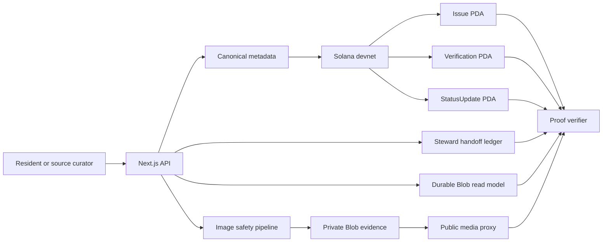

# Nagarik Signal

[](https://github.com/dantwoashim/Nagarik_Signals/actions/workflows/ci.yml)
[](https://github.com/dantwoashim/Nagarik_Signals/actions/workflows/production-smoke.yml)
[](https://explorer.solana.com/address/76PwNDW9hANj3tiebTEUdAj4yHYHVMfjcVDPjUWLQmqY?cluster=devnet)
[](nagarik-signal/apps/web)
[](LICENSE)

**Public proof for public problems.**

Nagarik Signal preserves civic evidence as an inspectable public record. A report or checked public-source dossier receives a sanitized evidence artifact, explicit provenance, an approximate location commitment, and a Solana devnet proof account. Follow-up signals and steward updates remain attached to the same record.

[Open Nagarik Signal](https://nagarik-signal.vercel.app) | [Explore public records](https://nagarik-signal.vercel.app/explore) | [Inspect the program](https://explorer.solana.com/address/76PwNDW9hANj3tiebTEUdAj4yHYHVMfjcVDPjUWLQmqY?cluster=devnet)


## Why This Exists

Nepal does not lack grievance channels. Hello Sarkar, Kathmandu Gunaso, Connect KMC, and agency-specific portals already accept reports. Nagarik Signal does a different job: it creates a public evidence commitment that civic groups, residents, newsrooms, and institutions can inspect before, during, and after an official grievance process.

```text
Observe -> sanitize -> hash -> anchor -> corroborate -> hand off -> track
```

The chain proves when a commitment was recorded and whether committed fields still match. It does not prove that every physical-world claim is true, that each signal is a unique person, or that a repair happened.

## Working Product

- **Writable reporting:** JPEG, PNG, and WebP evidence is decoded, resized, metadata-stripped, re-encoded, hashed, and stored privately.
- **Durable hosted state:** Vercel Blob stores the read model and media; fixed-path writes use ETag compare-and-swap with bounded retries.
- **Server-owned identity:** signed, HttpOnly civic-session cookies derive deterministic Solana signers without exposing private keys to the browser.
- **Public proof:** Issue, Verification, Steward, and StatusUpdate PDAs are deployed on Solana devnet.
- **Delivered-byte verification:** the proof panel fetches the evidence a visitor actually receives and recomputes its SHA-256 hash before comparing it with the read model and chain.
- **Provenance classes:** community reports, public-source dossiers, illustrative samples, and engineering fixtures are never mixed in public totals.
- **Abuse controls:** trusted-origin checks, upload receipts, rate limits, duplicate-evidence rejection, relayer circuit breakers, and constant-time steward authentication.
- **Moderation:** stewards can hide media while retaining proof, dispute a record, or remove a rejected record from discovery.
- **Official follow-up ledger:** stewards can record route preparation, channel delivery, a receipt-backed acknowledgement, follow-up, and closure without presenting those events as authority-authored updates.

## Public Data, Without Pretending

The default public watchlist contains four checked source dossiers. Each one records its publisher, source date, check date, review expiry, evidence hash, and devnet receipt. It does not claim a live field inspection.

| Record | Source | Public proof |
|---|---|---|
| Nagdhunga-Mugling utility-pole obstruction | [The Kathmandu Post](https://kathmandupost.com/national/2026/06/24/utility-pole-relocation-delays-hobble-road-widening-projects) | [Issue 12](https://nagarik-signal.vercel.app/issues/12) |
| Central Kathmandu drainage follow-up | [Kathmandu Metropolitan City](https://metronews.kathmandu.gov.np/news/detail/0507389732) | [Issue 13](https://nagarik-signal.vercel.app/issues/13) |
| Bancharedanda landfill service-life pressure | [Kathmandu Metropolitan City](https://metronews.kathmandu.gov.np/news/detail/0607285852) | [Issue 14](https://nagarik-signal.vercel.app/issues/14) |
| Dhangadhi and Kailari groundwater shortage | [The Kathmandu Post](https://kathmandupost.com/national/2026/06/27/hand-pumps-are-dry-even-deep-borewells-no-longer-provide-enough-water) | [Issue 15](https://nagarik-signal.vercel.app/issues/15) |

Thirty illustrative records are available under the separate **Samples** scope. Seven historical engineering fixtures remain addressable for audit work but are excluded from discovery, maps, dashboards, and public counts.

## Architecture



The read model stores searchable civic context. Solana stores compact commitments and lifecycle accounts. Neither is silently treated as the other: the proof verifier recomputes the record and compares both.

| Component | Location |
|---|---|
| Next.js application and API | [`nagarik-signal/apps/web`](nagarik-signal/apps/web) |
| Anchor program | [`nagarik-signal/programs/nagarik_signal`](nagarik-signal/programs/nagarik_signal) |
| Source and proof scripts | [`nagarik-signal/scripts`](nagarik-signal/scripts) |
| Public source manifest | [`nagarik-signal/data/public-sources`](nagarik-signal/data/public-sources) |
| Database adapter target | [`nagarik-signal/apps/web/lib/db/schema.sql`](nagarik-signal/apps/web/lib/db/schema.sql) |

Devnet program: [`76PwNDW9hANj3tiebTEUdAj4yHYHVMfjcVDPjUWLQmqY`](https://explorer.solana.com/address/76PwNDW9hANj3tiebTEUdAj4yHYHVMfjcVDPjUWLQmqY?cluster=devnet)

## Run Locally

Requirements: Node.js 22+, npm, and a modern browser.

```bash
git clone https://github.com/dantwoashim/Nagarik_Signals.git
cd Nagarik_Signals/nagarik-signal
npm ci
npm run seed:demo
npm run dev
```

Open `http://127.0.0.1:3001`.

Local development uses an atomic JSON file by default. A writable hosted deployment sets `NAGARIK_STORAGE_MODE=blob`, a private `BLOB_READ_WRITE_TOKEN`, the relayer secret, and independent session/security secrets documented in [`.env.example`](nagarik-signal/.env.example).

## Verification

```bash
cd nagarik-signal
npm run test:unit
npm run typecheck
npm run lint
npm run build
npm run test:e2e
npm run verify:deployment
```

`final:preflight` checks a running application. Start `npm run dev` in another terminal before running it locally, or set `NAGARIK_PREFLIGHT_BASE_URL=https://nagarik-signal.vercel.app` to check the stable deployment. `anchor:build` additionally requires the Solana and Anchor toolchains.

```bash
npm run final:preflight
npm run anchor:build
```

`anchor:test:devnet`, `phase2:smoke`, and `phase5:smoke` make funded devnet writes and require a configured relayer with devnet SOL.

`verify:deployment` checks the stable production release SHA, runtime write capabilities, trusted-origin boundary, secure session minting, public pages, detailed map provider, dashboard, and delivered-byte Solana proof. The production-smoke workflow runs it after every push to `main` and once daily without creating a public record.

## Trust Boundaries

| Claim | What is checked | What is not claimed |
|---|---|---|
| Evidence integrity | Delivered bytes match the stored and on-chain hash | The image depicts the claimed place or date |
| Record timestamp | A Solana transaction committed the issue | An authority accepted a legal complaint |
| Public signal | One rate-limited session created one Verification PDA | One signal equals one unique person |
| Status update | An authorized platform steward created a StatusUpdate PDA | A municipality authored or endorsed the update |
| Authority handoff | A steward appended a hash-chained event with the stated route, reference, or redacted receipt | The receiving authority authored, verified, or endorsed the event |
| Source dossier | The cited article and summary were checked on a stated date | The source remains current after its review window |

The program is on devnet and remains upgradeable by its authority. The relayer is a server-held hot key. Mainnet use requires an external program review, multisig governance, formal moderation operations, data-retention policy, and institutional agreements.

## Documentation

- [Architecture](nagarik-signal/ARCHITECTURE.md)
- [Data provenance](nagarik-signal/docs/data-provenance.md)
- [Security model](nagarik-signal/docs/security-model.md)
- [Research notes](nagarik-signal/docs/research-notes.md)
- [Safety policy](nagarik-signal/SAFETY.md)
- [Operating model](nagarik-signal/docs/operating-model.md)
- [Roadmap](nagarik-signal/ROADMAP.md)

## Contributing and Security

Read [`CONTRIBUTING.md`](CONTRIBUTING.md) before opening a pull request. Report vulnerabilities through the private process in [`SECURITY.md`](SECURITY.md), not a public issue.

## License

MIT. See [`LICENSE`](LICENSE).
