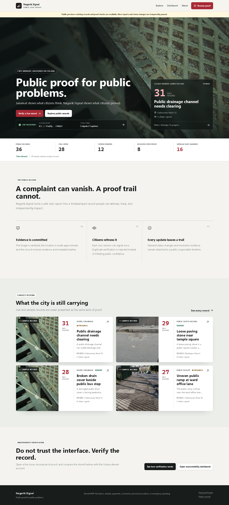
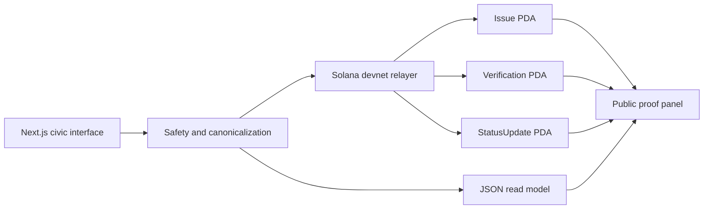

# Nagarik Signal

[](https://github.com/dantwoashim/Nagarik_Signals/actions/workflows/ci.yml)
[](https://explorer.solana.com/address/76PwNDW9hANj3tiebTEUdAj4yHYHVMfjcVDPjUWLQmqY?cluster=devnet)
[](nagarik-signal/apps/web)
[](LICENSE)

**Public proof for public problems.**

Nagarik Signal turns a safe public-infrastructure report into an inspectable civic record. Evidence, metadata, and approximate-location commitments are anchored to Solana devnet; citizens can verify an issue once; steward updates remain attached to a public timeline.

It is deliberately not a token product and not another private complaint queue.

[**Open the public preview**](https://nagarik-signal.vercel.app) | [**Verify a live devnet issue**](https://nagarik-signal.vercel.app/issues/11) | [**Inspect the Solana program**](https://explorer.solana.com/address/76PwNDW9hANj3tiebTEUdAj4yHYHVMfjcVDPjUWLQmqY?cluster=devnet)

The live site is currently a read-only public preview. Public records, dashboards, and independent Solana proof checks remain available while durable writes stay on the stateful deployment path described below.



## The Problem

A complaint can be acknowledged, moved between offices, edited, or quietly forgotten. Citizens usually cannot prove what was originally submitted, how long it remained open, or whether the visible record changed.

Nagarik Signal makes that history independently checkable:

```text
Report -> sanitize -> hash -> anchor -> witness -> track -> resolve
```

- The original evidence is sanitized before storage and committed by hash.
- Only an approximate location is published.
- Each issue receives an on-chain Issue PDA.
- Each accepted citizen signal receives a Verification PDA.
- Steward changes receive StatusUpdate PDAs and extend the timeline hash.
- The proof panel recomputes the displayed record and compares it with Solana.

## Verify A Public Record

The proof trail can be checked directly:

1. Open an issue marked `indexed_devnet`.
2. Inspect its evidence, age, status history, and citizen signals.
3. Run **Verify against Solana** in the proof panel.
4. Compare the recomputed hashes with the Issue PDA.
5. Open the accountability dashboard to see unresolved age by ward.

Sample records and live devnet records are labeled separately throughout the product. A sample record is never presented as on-chain proof.

## Why Solana

| Question | Application database | Nagarik Signal proof layer |
|---|---|---|
| When was this issue created? | Operator-controlled timestamp | Public transaction timestamp |
| Was the evidence replaced? | Requires trusting the operator | Evidence hash is committed to the Issue PDA |
| Can one signer verify repeatedly? | Mutable application rule | Verification PDA rejects a duplicate signer/session |
| Can status history be rewritten? | Admin history can change | StatusUpdate PDAs extend an inspectable timeline |
| Can anyone check the record? | Trust an export or screenshot | Recompute hashes and compare with chain state |

Solana is used as public proof infrastructure. Nagarik Signal has no token, rewards, payments, betting, or speculative mechanism.

## Architecture



The read model serves searchable civic context. Solana stores the public commitments and lifecycle proof. The two are compared in the product instead of being treated as interchangeable.

| Component | Location |
|---|---|
| Next.js application and API | [`nagarik-signal/apps/web`](nagarik-signal/apps/web) |
| Anchor program | [`nagarik-signal/programs/nagarik_signal`](nagarik-signal/programs/nagarik_signal) |
| Proof and indexing scripts | [`nagarik-signal/scripts`](nagarik-signal/scripts) |
| Schema and read model | [`nagarik-signal/supabase`](nagarik-signal/supabase), [`nagarik-signal/data`](nagarik-signal/data) |
| Product documentation | [`nagarik-signal/docs`](nagarik-signal/docs) |

Devnet program: [`76PwNDW9hANj3tiebTEUdAj4yHYHVMfjcVDPjUWLQmqY`](https://explorer.solana.com/address/76PwNDW9hANj3tiebTEUdAj4yHYHVMfjcVDPjUWLQmqY?cluster=devnet)

## Run Locally

Requirements: Node.js 22+, npm, and a modern browser.

```bash
git clone https://github.com/dantwoashim/Nagarik_Signals.git
cd Nagarik_Signals/nagarik-signal
npm ci
npm run seed:demo
npm run dev
```

Open `http://127.0.0.1:3001`.

The seeded read model contains safe sample records and remains explicitly labeled `seeded_demo` at the data-contract level. Live write operations require the Solana relayer configuration documented in [`.env.example`](nagarik-signal/.env.example).

## Verify the Build

```bash
cd nagarik-signal
npm run verify
npm run build
npm run test:e2e
npm run anchor:build
```

For a running app:

```bash
npm run final:preflight
```

`anchor:test:devnet`, `phase2:smoke`, and `phase5:smoke` execute funded devnet writes and therefore require a configured relayer wallet with devnet SOL.

## Deployment Boundary

The current MVP stores its read model, session keys, and sanitized uploads on disk. Full report and steward flows therefore require a stateful Node host with a persistent volume mounted through `NAGARIK_DATA_DIR`; the included [`Dockerfile`](nagarik-signal/Dockerfile) provides that path.

The live [Vercel public preview](https://nagarik-signal.vercel.app) serves the public read and proof surfaces with write controls disabled. It is not presented as a durable write deployment. See the [product README](nagarik-signal/README.md#deployment) for the complete environment and storage contract.

## Safety Boundary

- Public infrastructure only.
- Approximate location only.
- EXIF metadata is stripped before evidence is stored.
- No faces, license plates, private homes, personal accusations, comments, or emergency reporting.
- A steward resolution update is evidence attached to a public record, not an official government completion certificate.
- MVP verification is duplicate-resistant per signer/session; it is not proof of personhood.

Read the complete [safety policy](nagarik-signal/SAFETY.md) and [privacy notes](nagarik-signal/docs/privacy-and-safety.md).

## Documentation

- [Product README](nagarik-signal/README.md)
- [Architecture](nagarik-signal/ARCHITECTURE.md)
- [Product FAQ](nagarik-signal/docs/product-faq.md)
- [Why Solana](nagarik-signal/docs/why-solana.md)
- [Roadmap](nagarik-signal/ROADMAP.md)

## Contributing and Security

Read [`CONTRIBUTING.md`](CONTRIBUTING.md) before opening a pull request. Report security issues through [`SECURITY.md`](SECURITY.md), not a public issue.

## License

MIT. See [`LICENSE`](LICENSE).
