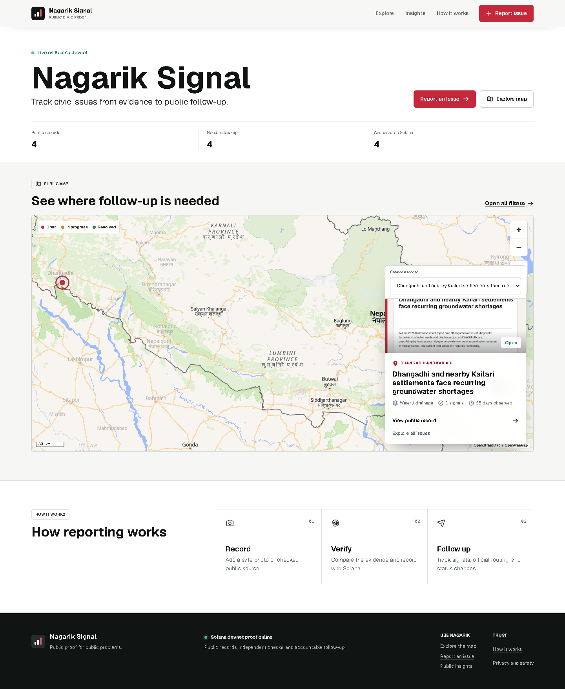

# Nagarik Signal

[](https://github.com/dantwoashim/Nagarik_Signals/actions/workflows/ci.yml)
[](https://github.com/dantwoashim/Nagarik_Signals/actions/workflows/security.yml)
[](https://github.com/dantwoashim/Nagarik_Signals/actions/workflows/production-smoke.yml)
[](LICENSE)

**Public proof for public problems.**

Nagarik Signal is a civic record system for documenting public infrastructure
issues and following them through review, publication, handoff, and resolution.
It keeps the operational workflow in Postgres and anchors compact integrity
commitments on Solana.

[Open the public preview](https://nagarik-signal.vercel.app) |
[Browse records](https://nagarik-signal.vercel.app/explore) |
[Read the architecture](ARCHITECTURE.md)



## Release Profile

The implemented target is `curated_pilot_v2_non_mainnet`.

| Capability                            | Current policy                                                                 |
| ------------------------------------- | ------------------------------------------------------------------------------ |
| Public approved records and proof     | Enabled                                                                        |
| Invite-based civic intake             | Implemented; closed by runtime kill switch until an operator enables it        |
| Invite-based public signals           | Implemented; closed by runtime kill switch until an operator enables it        |
| Operator review and lifecycle actions | Managed identity, AAL2, organization scope, and role checks required           |
| Legacy v1 Solana writes               | Disabled; v1 remains readable for historical proof                             |
| v2 Solana writes                      | Server-owned, non-mainnet profile only                                         |
| Real civic data                       | Disabled until the privacy/legal gate has a recorded approval                  |
| Production or mainnet release         | Blocked by independent security, legal, custody, recovery, and operator review |

The release verifier treats every absent artifact or external review as a
blocker. It does not turn an incomplete checklist into a passing release.

## How A Record Becomes Public

```text
invitation
  -> sanitized private upload
  -> private submission
  -> operator review
  -> redacted public derivative
  -> immutable approved version
  -> durable Solana outbox
  -> finalized v2 commitment
  -> public projection
```

1. An intake capability authorizes one bounded reporting session.
2. The image pipeline decodes and re-encodes the upload, strips metadata,
   limits dimensions and bytes, and stores the result privately.
3. The report remains private while an operator reviews its text, location,
   provenance, and media.
4. Approval freezes an immutable public version and creates a durable outbox
   job in the same database transaction.
5. A bounded worker writes the v2 commitment and records the exact finalized
   account observation.
6. Publication occurs only after the database version, media derivative, and
   finalized chain commitment agree.

Corrections, lifecycle updates, authority handoffs, removals, and public
signals append new history. They do not rewrite an earlier public version.

## Why Solana

Postgres is the workflow authority because civic operations need private
review, authorization, transactions, retention, and queryable history. Solana
is the public commitment layer because independent readers can inspect a
timestamped account without relying on the application database.

The v2 program stores two account families:

- `IssueCommitment`, keyed by `['issue', issue_id]`, holds the current evidence,
  metadata, location, lifecycle, and event-head commitments;
- `CommitmentEvent`, keyed by `['event', issue, sequence]`, preserves ordered
  changes with previous and new hashes.

The chain proves that specific bytes and fields were committed in a specific
order. It does not prove that a photograph is truthful, that a signal is a
unique person, or that an authority accepted a complaint.

## Repository Layout

| Path                                                       | Purpose                                                                 |
| ---------------------------------------------------------- | ----------------------------------------------------------------------- |
| [`apps/web`](apps/web)                                     | Next.js public, tracking, operator, media, and API surfaces             |
| [`apps/web/lib/services`](apps/web/lib/services)           | Transactional civic workflows                                           |
| [`supabase/migrations`](supabase/migrations)               | Postgres schema, constraints, RLS, and append-only protections          |
| [`programs/nagarik_signal_v2`](programs/nagarik_signal_v2) | Current Anchor protocol                                                 |
| [`programs/nagarik_signal`](programs/nagarik_signal)       | Frozen v1 compatibility program                                         |
| [`idl`](idl)                                               | Versioned program interfaces                                            |
| [`scripts`](scripts)                                       | Workers, reconciliation, security, deployment, and release verification |
| [`docs/adr`](docs/adr)                                     | Architecture decisions                                                  |
| [`docs/production`](docs/production)                       | Contracts, threat model, release criteria, and execution evidence       |

## Local Setup

Requirements:

- Node.js `22.23.1` and npm `11.x`;
- Docker for the local Supabase stack;
- Rust `1.94.0`, Anchor `0.30.1`, and the pinned nightly toolchain for program
  and generated-IDL checks.

Install the locked JavaScript dependencies and start the local services:

```bash
npm ci
npm run db:start
npm run db:reset
npm run dev
```

Copy [`.env.example`](.env.example) to `apps/web/.env.local` and fill the local
Supabase URL, keys, database URL, and independent development secrets before
exercising private intake or operator routes. Production rejects local storage,
filesystem signer custody, shared legacy secrets, and placeholder credentials.

The web application runs at `http://127.0.0.1:3001`.

## Verification

The main local gates are:

```bash
npm run verify
npm run db:test
npm run build
npm run test:e2e
npm run audit:production
npm run audit:security
cargo fmt --all -- --check
cargo clippy --workspace --all-targets -- -D warnings
cargo test --workspace
npm run anchor:idl:check
```

`npm run verify:release:report` assembles a machine-readable release manifest
under `artifacts/release/`. The strict `npm run verify:release` command exits
nonzero until every automated and external release gate has valid evidence.

`npm run verify:deployment` is read-only. It checks an exact deployed commit,
health and readiness responses, public v2 APIs, proof delivery, pages, media,
and response headers without creating or changing a civic record.

## Trust Boundaries

| Public statement   | What the system can verify                                                        | Boundary                                                   |
| ------------------ | --------------------------------------------------------------------------------- | ---------------------------------------------------------- |
| Evidence integrity | Delivered bytes match the approved version and recorded commitment                | Content truth and capture context still require review     |
| Record history     | Ordered metadata and lifecycle commitments match the finalized v2 account history | A chain timestamp is not official government receipt       |
| Public signal      | A valid capability appended one rate-limited attention event                      | A signal is not proof of personhood or truth               |
| Authority handoff  | A steward recorded a route, external reference, or reviewed receipt               | The receiving authority did not author the platform record |
| Removal            | Public access is denied and a neutral tombstone remains                           | Existing chain commitments cannot be erased                |

See [the security model](docs/security-model.md), [safety policy](SAFETY.md),
and [release criteria](docs/production/release-criteria.md) for the complete
boundary.

## Contributing

Read [`CONTRIBUTING.md`](CONTRIBUTING.md) before opening a pull request. Report
security or privacy-sensitive defects through the private process in
[`SECURITY.md`](SECURITY.md).

## License

MIT. See [`LICENSE`](LICENSE).
